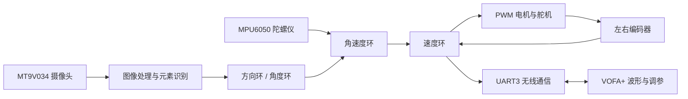

# TC387 Smart Car | VOFA+ Vehicle Control

<p align="center">
  
  
  
  
</p>

<p align="center"><strong>一套面向智能车竞赛的感知、控制、通信与在线调参系统</strong></p>

基于 Infineon AURIX TC387QP 和龙邱 LQ_TC387 软件库的智能车最终版工程。它把“看见赛道、理解赛道、控制车辆、观察结果、在线调参”串成一个完整闭环，适合竞赛开发、嵌入式学习和控制算法验证。

> <span style="color:#0969da"><strong>项目关键词</strong></span>：TC387 · 智能车 · 机器视觉 · 串级 PID · 无线遥测 · VOFA+ · 多核控制

## 项目一览

| 方向 | 能力 | 说明 |
| --- | --- | --- |
| 感知 | 摄像头赛道识别 | 从灰度图像中提取边缘、中线和路口特征 |
| 决策 | 路径规划 | 根据赛道元素生成车辆期望行驶方向 |
| 控制 | 多环 PID | 方向/角度、角速度、左右速度逐层闭环 |
| 执行 | 电机与舵机 | 编码器反馈、PWM 输出、差速控制 |
| 观测 | VOFA+ 遥测 | 实时波形、参数修改和运行状态监控 |
| 安全 | 故障保护 | 通信超时、冲出赛道和紧急停车 |

## 系统思路

项目采用“分层控制 + 多核分工 + 上位机观测”的思路：

1. **感知层**从摄像头、编码器、陀螺仪和 ADC 获取车辆与赛道信息。
2. **理解层**完成图像处理、元素识别和路径规划，输出赛道偏差或目标偏航角。
3. **控制层**把外环目标逐级转换为角速度、左右轮速度和 PWM。
4. **通信层**通过 UART 与 WiFi/蓝牙模块连接，将车辆状态送入 VOFA+，也接收在线调参命令。
5. **安全层**对参数范围、通信状态和停车动作进行保护。



## 硬件与软件

| 类别 | 配置 |
| --- | --- |
| 主控 | Infineon AURIX TC387QP |
| 开发板 | 龙邱 LQ_TC387 核心板及 V7 母板 |
| 传感器 | MT9V034 摄像头、编码器、MPU6050/陀螺仪、ADC |
| 执行器 | 无刷电机、舵机、PWM 驱动 |
| 开发环境 | AURIX Development Studio 1.10.x |
| 编译器 | Tasking TriCore Compiler |
| 调试 | DAP MiniWiggler / winIDEA |
| 上位机 | VOFA+，FireWater 数据引擎 |

## 主要功能

- 摄像头采集、二值化、边缘和赛道中线提取
- 十字、T 字、环岛、坡道等赛道元素识别
- 方向环、角度环、角速度环和速度环控制
- 编码器速度反馈、陀螺仪姿态解算和电机差速控制
- WiFi/蓝牙无线串口通信及实时状态回传
- VOFA+ 在线修改 PID 参数、基础速度和目标偏航角
- 远程发车、停车和通信超时自动停车

## 工程结构

```text
LQ_TC387_Software_Library/
├── Main/                  多核入口、系统配置和中断
├── Src/APP/               摄像头、电机、编码器、IMU、VOFA 等应用模块
├── Src/Driver/            UART、SPI、QSPI、DMA、PWM 等底层驱动
├── Src/User/              PID、路径规划和用户算法
├── Libraries/             Infineon iLLD 与基础服务库
├── Configurations/        芯片和启动配置
└── *.md                   VOFA 方案与使用说明
```

## VOFA+ 通信

车辆向 VOFA+ 输出 `STATE:<ch0>,<ch1>,...,<ch11>\n` FireWater 数据。

| 通道 | 内容 | 用途 |
| --- | --- | --- |
| ch0~ch3 | 左右轮目标/实际速度 | 判断速度环跟踪效果 |
| ch4~ch5 | 左右轮 PWM | 观察输出饱和和左右差异 |
| ch6~ch7 | 目标/实际角速度 | 判断角速度环响应 |
| ch8~ch9 | 目标/实际偏航角 | 观察角度控制误差 |
| ch10 | 赛道偏差 | 观察视觉输入稳定性 |
| ch11 | 车辆状态 | `0=停车`，`1=运行` |

下行命令采用 `命令名:数值\n` 格式：

```text
base_speed:100
speed_kp:35.0
car_start:1
car_stop:1
```

常用命令包括 `speed_kp`、`speed_ki`、`gyro_kp`、`gyro_kd`、`dir_kp`、`base_speed`、`angle_mode`、`target_yaw`、`car_start` 和 `car_stop`。

## 快速开始

1. 安装 AURIX Development Studio、Tasking TriCore Compiler 和 DAP MiniWiggler 驱动。
2. 导入 `LQ_TC387_Software_Library` 工程，确认工程路径使用英文字符。
3. 检查 `Main/config.h`、引脚映射、UART3 和 PID 初始参数。
4. 编译工程并使用 DAP MiniWiggler 烧录到 TC387。
5. 将无线模块连接到 UART3，VOFA+ 设置为 115200、8N1、FireWater。
6. 先以低速运行，确认波形、`car_stop` 和超时停车均正常。

## 推荐调试顺序

```text
传感器自检 → 电机方向确认 → 左右速度环 → 角速度环
    → 方向/角度外环 → 路口策略 → 无线参数在线优化
```

每次只修改一个参数，并保存“参数值 + 场地 + 速度 + 波形表现”，这样才能区分控制器问题、传感器噪声和机械差异。

## 安全与限制

在线调参会直接影响真实车辆。首次测试应抬起驱动轮、设置低基础速度，并优先验证 `car_stop`。通信中断保护不能替代人工断电和物理安全措施。仓库提供的是竞赛工程快照，不承诺适用于未经验证的硬件接线或车辆结构。

## 相关文档

- [VOFA使用说明.md](VOFA使用说明.md)：硬件连接、串口设置、命令表和排障流程
- [VOFA车辆控制系统实施方案.md](VOFA车辆控制系统实施方案.md)：协议选择、软件架构和安全设计依据
- [smart-car-three-cascade-loop](https://github.com/dedehorse/smart-car-three-cascade-loop)：三串级控制环版本
- [smart-car-history](https://github.com/dedehorse/smart-car-history)：历史迭代归档

## 许可与致谢

本工程使用龙邱 LQ_TC387 软件库及 Infineon iLLD。上游库的许可证和版权声明以仓库内原始文件为准。
